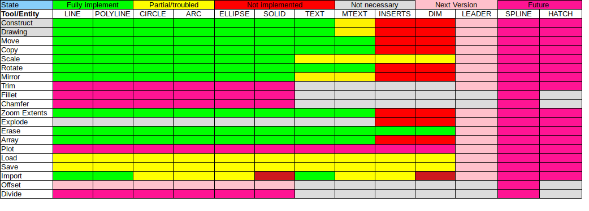
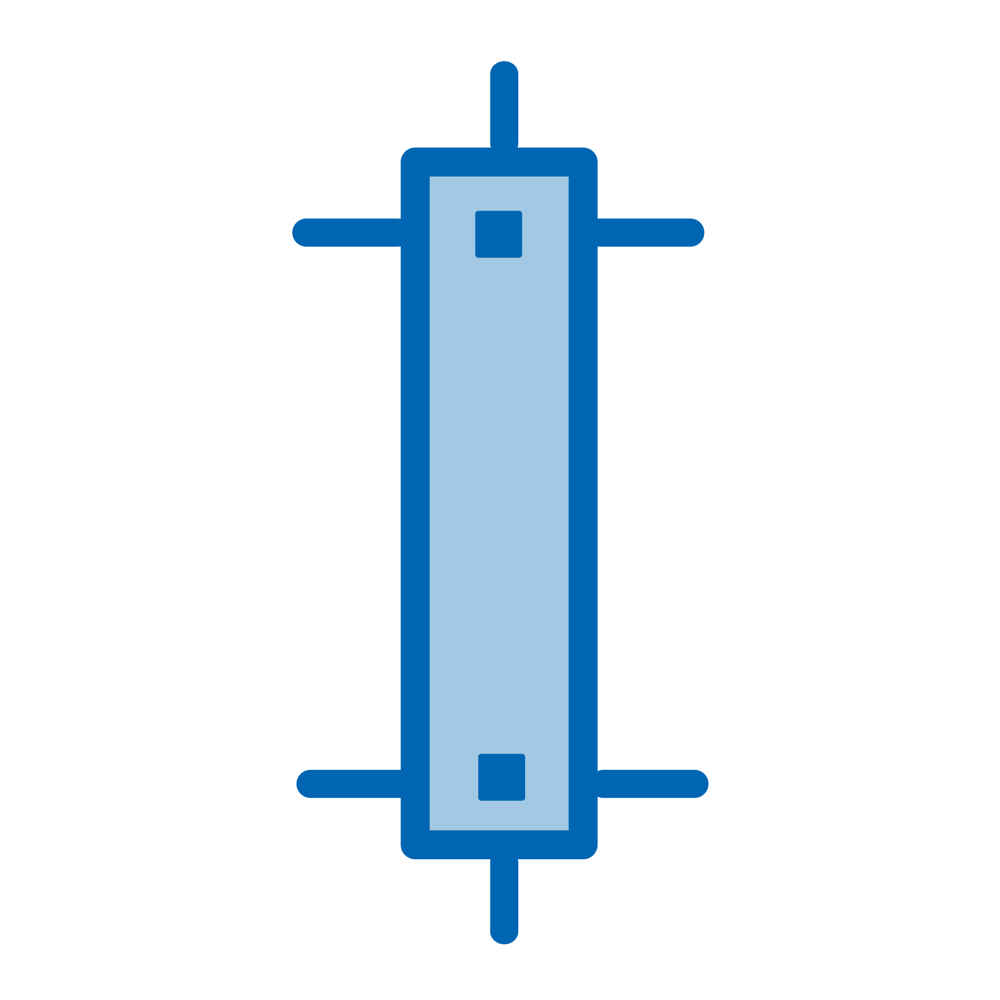
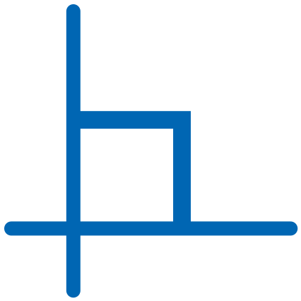

# GauchoCAD
GauchoCAD is a free CAD program written in the Gambas language.

## Graphics
Actually we use the OpenGL library for the graphics (before we try cairo and paint) because is really fast but some work still there with the diferent line styles like dashed

## History
At the beginning this program was created as a practice in the use of classes and over time it was mutating, increasing the number of graphic tools, improving the interface etc.
CAD programs belong to the group of large and complex programs since for this to work it must handle various things from geometric calculations and graphical representation to configurations, user profiles, interpreter of orders, scripting printing, export and import in differents files formats, etc.
GauchoCAD is currently under development and the status is as follows:

## Using

# Entities
| Icon | Alias | Name | Description |
|------|:-----:|:----:|------------:|
|  | a | Arc | Create an arc |
|  | cv | Circle | Create a circle |
|  | dw | Dim | Create a dimension |
|  | ew | Ellipse | Create an ellipse |
|  | ht | Hatch | Create an hatch |
|  | b | Insert | Create a block insert |
|  | li | Leader | Create a leader |
|  | l | Line | Create a line |
|  | tt | Mtext | Create a mtext |
|  | po | Pline | Create a polyline |
|  | re | Rectangle | Create an rectangle |
|  | sa | Solid | Create an solid |
|  | sq | Spline | Create an spline |
|  | t | Text | Create a text |

# Tools
| Icon | Alias | Name | Description |
|------|:-----:|:----:|------------:|
|  | bg | Break | Brak a entity in two parts |
|  | cd | Chamfer | Create a chamfer from two lines |
|  | c | Copy | Copy an entity |
|  | dx | Divide | Divide an entity |
|  | de | Erase | Delete an entity |
|  | e | Extend | Stretch an entity from one end |
|  | f | Fillet | Create a tangential arc to two lines |
|  | mn | Mirror | Create a new entity mirroring another |
|  | m | Move | Move a site entity |
|  | fg | Offset | Create a parallel entity |
|  | zc | Pan | Displacement of sight |
|  | rt | Rotate | Rotate an entity |
|  | sc | Scale | Scale an entity |
|  | s | Stretch | Stretch an entity |
|  | tr | Trim | Cut an entity |
|  | zx | Zoome | View fit to all entities |
|  | z | Zoomw | View window |

# Layers
| Icon | Alias | Name | Description |
|------|:-----:|:----:|------------:|
|  | lk | Layers |  |

# Smart - concret structures
| Icon | Alias | Name | Description |
|------|:-----:|:----:|------------:|
|  | w1 | Beam |  |
|  | w2 | Column |  |
|  | w3 | Slab3P |  |
|  | w4 | Slab4P |  |
|  | w5 | Wallcolumn |  |

# Locks
| Icon | Key | Name | Description |
|------|:-----:|:----:|------------:|
|  | F1 | Help |  |
|  | F2 | Spare |  |
|  | F3 | Spare |  |
|  | F4 | Spare |  |
|  | F5 | Spare |  |
|  | F6 | Bounds | Enable or disable the bounds in drawing |
|  | F7 | Grid | Enable or disable the grid in screen |
|  | F8 | Ortho | Enable or disable the orthogonal mode |
|  | F9 | Spare |  |
|  | F10 | Spare |  |
|  | F11 | Spare |  |
|  | F12 | Spare |  |

## Contact
gauchocad@gmail.com

## Gambas project
Gambas is a free development environment and a full powerful development platform based on a Basic interpreter with object extensions.
http://gambas.sourceforge.net/en/main.html

