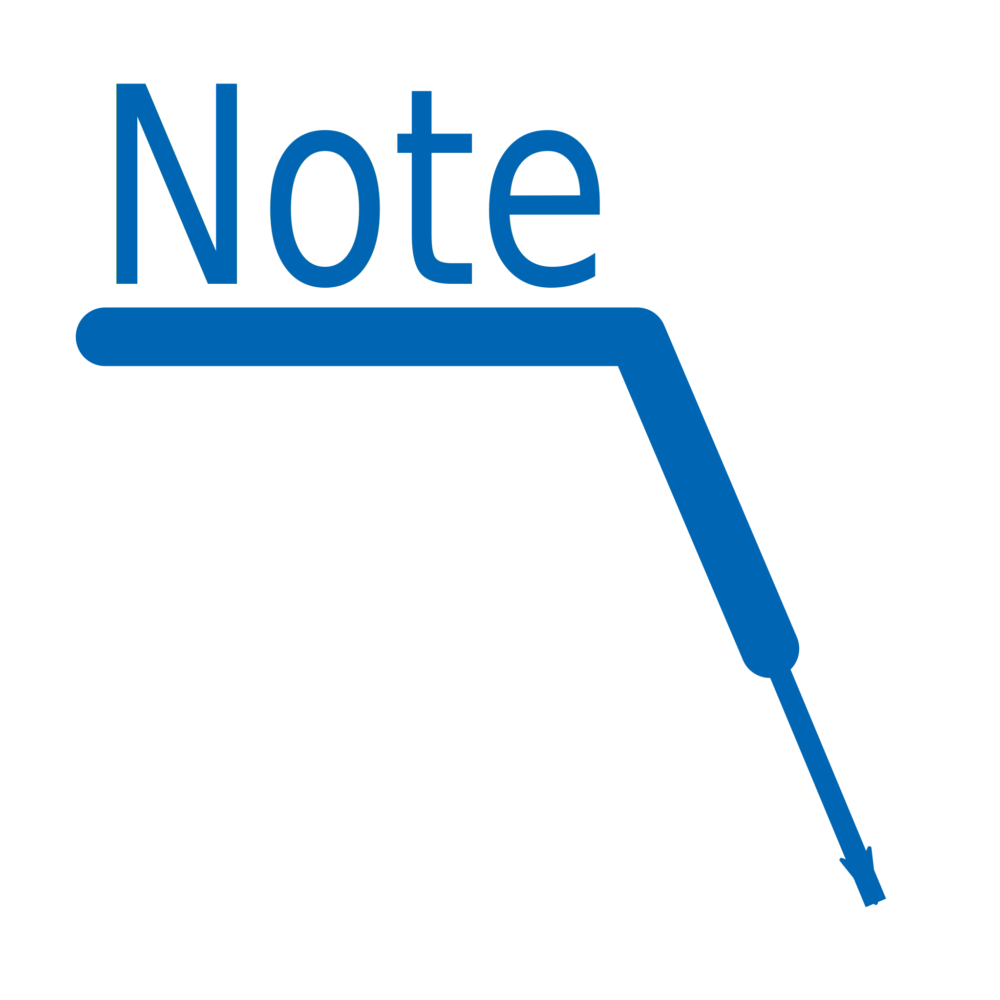
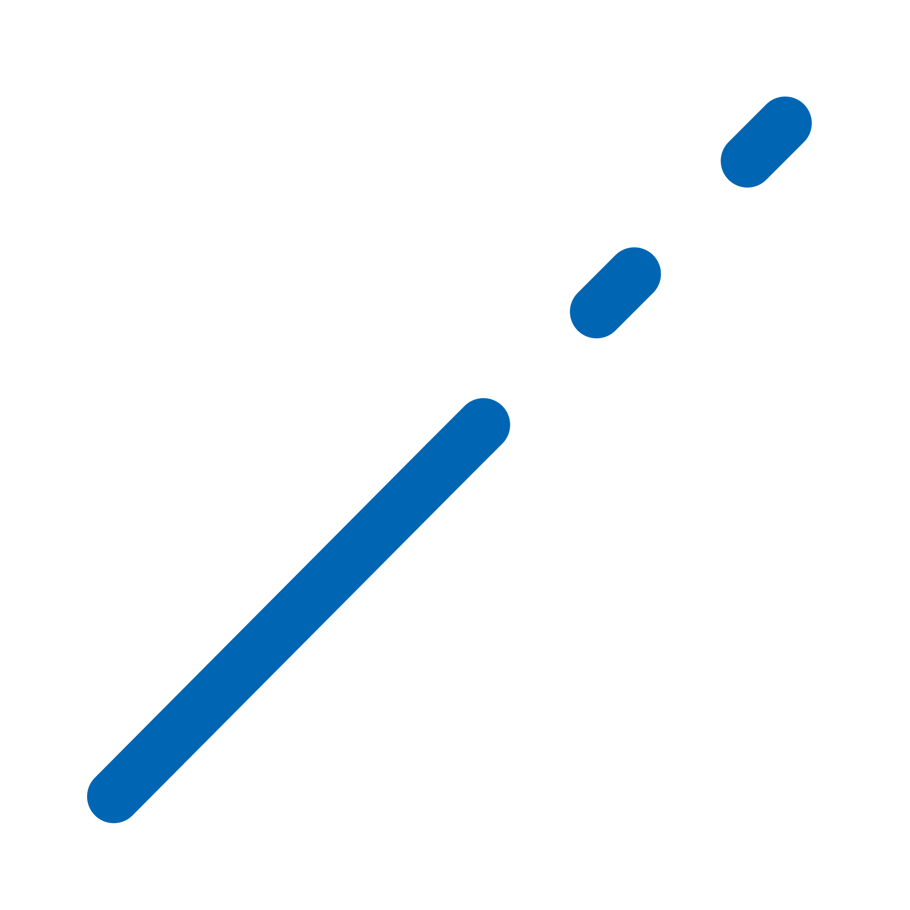

# GauchoCAD
GauchoCAD is a free CAD program written in the Gambas language.
### v0.0.81

## Graphics
Actually we use the OpenGL library for the graphics (before we try cairo and paint) because is really fast but some work still there with the diferent line styles like dashed

## History
At the beginning this program was created as a practice in the use of classes and over time it was mutating, increasing the number of graphic tools, improving the interface etc.
CAD programs belong to the group of large and complex programs since for this to work it must handle various things from geometric calculations and graphical representation to configurations, user profiles, interpreter of orders, scripting printing, export and import in differents files formats, etc.
GauchoCAD is currently under development and the status is as follows:

## Using

# Entities
| Icon | Alias | Name | Description |
|------|:-----:|:----:|------------:|
|  | a | Arc | Create an arc |
|  | cv | Circle | Create a circle |
|  | dw | Dim | Create a dimension |
|  | ew | Ellipse | Create an ellipse |
|  | ht | Hatch | Create an hatch |
|  | b | Insert | Create a block insert |
|  | li | Leader | Create a leader |
|  | l | Line | Create a line |
|  | tt | Mtext | Create a mtext |
|  | po | Pline | Create a polyline |
|  | re | Rectangle | Create an rectangle |
|  | sa | Solid | Create an solid |
|  | sq | Spline | Create an spline |
|  | t | Text | Create a text |

# Tools
| Icon | Alias | Name | Description |
|------|:-----:|:----:|------------:|
|  | ar | Array | Create a patern, it could be rectangular or polar |
|  | bg | Break | Brak a entity in two parts |
|  | cd | Chamfer | Create a chamfer from two lines |
|  | c | Copy | Copy an entity |
|  | dx | Divide | Divide an entity |
|  | de | Erase | Delete an entity |
|  | e | Extend | Stretch an entity from one end |
|  | f | Fillet | Create a tangential arc to two lines |
|  | mn | Mirror | Create a new entity mirroring another |
|  | m | Move | Move a site entity |
|  | fg | Offset | Create a parallel entity |
|  | rt | Rotate | Rotate an entity |
|  | sc | Scale | Scale an entity |
|  | s | Stretch | Stretch an entity |
|  | tr | Trim | Cut an entity |
|  | zc | Pan | Displacement of sight |
|  | zx | Zoome | View fit to all entities |
|  | z | Zoomw | View window |

# Layers
| Icon | Alias | Name | Description |
|------|:-----:|:----:|------------:|
|  | lk | Layers |  |

# Smart - concret structures
| Icon | Alias | Name | Description |
|------|:-----:|:----:|------------:|
|  | w1 | Beam |  |
|  | w2 | Column |  |
|  | w3 | Slab3P |  |
|  | w4 | Slab4P |  |
|  | w5 | Wallcolumn |  |

# Locks
| Icon | Key | Name | Description |
|------|:-----:|:----:|------------:|
|  | F1 | Help |  |
|  | F2 | Spare |  |
|  | F3 | Spare |  |
|  | F4 | Spare |  |
|  | F5 | Spare |  |
|  | F6 | Bounds | Enable or disable the bounds in drawing |
|  | F7 | Grid | Enable or disable the grid in screen |
|  | F8 | Ortho | Enable or disable the orthogonal mode |
|  | F9 | Spare |  |
|  | F10 | Spare |  |
|  | F11 | Spare |  |
|  | F12 | Spare |  |

## Developer help
### Module glPlus
  
 - **letterSt**  Genera n arrays de vertices
  
 - **fontSt** 
 
 - **textureSt** 
 
 - **punto3d** 
 
 - **punto2d** 
 
 - **GLColorSt** 
 
 - **Resize** 
 
 - **Lines**   ' ' lets make shaders  ' ' create the VertexShader and get Id  ' 'shaVert1 = GL.CreateShader(gl.VERTEX_SHADER)  ' ' set the source code  ' ' compile  ' ' chequeamos que todo haya salido OK  ' ' creamos el shader de coloreado o Fragment  ' ' una vez complilados, no se necesitan mas Dibuja un rectangulo, relleno o vacio. Puede dibujar un contorno del mismo de otro color->Bounding Mode: 0=relleno, 1=relleno y recuadro, 2=solo recuadro Dibuja un serie de lineas
  
 - **PolygonFilled**  Dibuja un seria de polilinea
  
 - **Polygon**  Dibuja un seria de polilinea
  
 - **Arc**  Dibuja un arco, suponiendo que el centro esta en 0,0 (despues de un Translate()) Siempre gira en sentido anti-horario Las medidas de los angulo inicial y recorrido estan en RADIANES
  
 - **PolyLines**  Dibuja un seria de polilinea
  
 - **Circle**  Dibuja un circulo
  
 - **Get3DpointFromScreen**   ' '  ' ' Trnasforma un punto de la pantalla en un punto del espacio, que en realidad es un rayo en 3D que en 2D es perpendicular a la pantalla
  
 - **SelectFont**  Establece la fuente con que se dibujaran los textos
  
 - **LoadFonts**  Lee todas las fuentes del directorio provisto y devuelve un listado con sus nombres
  
 - **GetCodeIndex**  Busca el codigo UTF y devuelve la posicion en el indice de letras
  
 - **DrawText**  Grafica un texto en el contexto actual de acuerdo a los parametros pasados Debe estar definida la Font con nombre y altura
  
 - **DrawMultilineText**  Grafica un texto de varias lineas en el contexto actual de acuerdo a los parametros pasados Debe estar definida la Font con nombre y altura
  
 - **TextExtends**  devuelve un rectangulo que contiene al texto [x,y,ancho,alto]
  
 - **MTextExtends**  devuelve un rectangulo que contiene al texto [x,y,ancho,alto]
  
 - **LoadTextures**  Lee todas las texturas del directorio provisto y devuelve un listado con sus nombres
  
### Module modUtils
  
 - **punto3d**  Dibuja un triangulo con una textura ya cargada
  
 - **punto2d** 
 
 - **NInt** 
 
 - **file_replace** 
 
 - **FileAppend** 
 
 - **CPval** 
 
 - **GetParam** 
 
 - **fEval** 
 
### Module Starter
  
 - **Run** 
 
### Module cad
  
 - **SaveGaucho**  This load all the info form a gaucho xml file, then put it in a collection a nd return it.
  
 - **LoadGaucho**  This load all the info form a gaucho xml file, then put it in a collection a nd return it.
  
 - **Skeleton**  This give the skeleton of a gaucho file as collection, a model collection including each section
  
 - **CheckModel** 
 
 - **NewLayer**  This give the layer 0 and its information
  
 - **NewVars** 
 
 - **Styles** 
 
 - **NewWidths** 
 
 - **ExportSVG** 
 
 - **ImportDxf** 
 
 - **ImportDwg** 
 
 - **GetLayersList** 
 
 - **GetEntityList** 
 
 - **dwgread** 
 
 - **Sections** 
 
 - **Objects** 
 
 - **Header** 
 
 - **DecodeCommon**  Decode the common fields for any entity
  
 - **DecodeEntity**  Decode the fields for a specific entity
  
 - **EntityDefaults**  This return a codes collection for the given entity name
  
 - **EntityCodes**  This return a codes collection for the given entity name
  
 - **RGBColors**  Return a String[] with the form r,g,b where each index is the dxf color number
  
 - **DecodeColor**  Input a dxf color return a rgb color
  
 - **CADConfig**  Create a collection whith te program variables needed
  
 - **GetDXFSections** 
 
 - **GetDXFBlocks** 
 
 - **GetDXFEntities** 
 
 - **GetDXFHeader** 
 
 - **GetDXFTables** 
 
### Module dbs
  
 - **DataExport**  
 Data export of a result in CSV format. The input parameters are as follows. 
 <ol start = "0"> <li> con - Open connection to the database </li> <li> ctn - Collection with several items </li> < / ol> <li> </li> 
 The collection must have the following items 
 <ul> <li> File The full path of the file to be exported </li> <li> Query The query that will be used to list the database data </li> <li> Separator The list separator character that will be used in the export file </li> </ul>
  
 - **DBTemplate**  Create a database template that is passed to it as parameters.
  
 - **FileSqlLoad** 
 
 - **DBConf** 
 
 - **DBSqlite**  Starts a database or creates and starts it. Returns a connection and as an input parameter requires an array with the base parameters. If the database does not exist, then create one and start it. 'If the database does exist then you can do two things, start it or create a backup and create a new database. stxDB contains the base parameters. 0 - DBHost. 1 - DBName. 2 - DBPath
  
 - **RecordPrimaryKey**  Returns the name of the key field in the table. GEFStarter.conProgram As Connection is the connection to the database. tab As String is the name of the table on which you try to know what type of field it is. strFieldCheck As String It is the field to verify. strValueCheck As String Is the value of the record for the field to verify. GEFStarter.stxTableFields As String [] It is the list of all the fields in the database.
  
 - **RecordValue** 
 
 - **getIndex** 
 
 - **RecordExist**  
Devuelve la clave si el registor existe y -1 si no existe. Como parametros de entrada requiere una conexión, el nombre de la tabla y una coleccion con el campo y el valor de busqueda.

  
 - **RecordDelete**  
Borra los registros de la tabla que coinciden con las claves de inx. .

  
 - **SqlMake** 
 
 - **RWords** 
 
 - **UsualFieldName** 
 
 - **UsualFieldsNames** 
 
### Module dsk
  
 - **UsualFieldsNames** 
 
 - **TextWidth** 
 
 - **ImageDot**  Returns a circular image with the color indicated as a parameter
  
 - **ImageFrame** 
 
 - **GNumix** 
 
### Module fil
  
 - **GNumix** 
 
 - **FileCRC32** 
 
 - **Id3Frm** 
 
 - **Id3Include** 
 
### Module sog
  
 - **Resume** 
 
 - **DeFiBro**  Returns the default file manager.
  
 - **DistroNoshell**  Returns the xmi installed distribution
  
 - **Distro** 
 
 - **ArqSO** Returns the Architecture of the Operating System
  
 - **ArqMicro** Returns the Processor Architecture
  
 - **MicroType**  Returns the type of Processor
  
 - **Ram**  Returns amount of Ram in MB also with free -m
  
 - **ComputerName**  Returns the computer name
  
 - **CurrentUser**  Returns the active user
  
 - **GetProjectsDir**  List the shrimp project directories recursively from the directory passed to it as a parameter.
  
 - **GetProjectInfo**  Returns an array with the data of a shrimp project, as an input parameter you require the root directory of the project.
  
 - **GetFarmInfo** Returns an array with the data of a prawn project hosted on the farm, as input parameter requires the project identifier.
  
 - **GetSystemUsers**  Returns the a list of Linux system users.
  
 - **AllUsers**  Returns the users we have created
  
 - **WGroup**  Returns the Computer Workgroup
  
 - **SysFile**  Returns the filesystem
  
 - **Vgambas** Returns the gambas version installed on the computer
  
 - **ProjInfo** Returns a collection with the project information housed in the ".project" file. If you do not pass the path of the .project file from which you want to extract the information, the function will return the data of the local project. Then, the order of each item is as follows:<ol start="0"><li>Title</li><li>Description</li><li>Authors</li><li>Vendor</li><li>Version</li><li>Component</li><li>Language</li><li>Startup</li><li>Icon</li></ol>
  
 - **AddressIP**  Returns the IP of the computer, it only works under OS with Systemd, for this it uses shell and the command "ip addr show".
  
 - **LANIP**  Returns the IP v4 of the local network, as input parameter requires the base IP address, for example "192.168.1" but if the parameter is not passed then use the IP of the computer where the program is running removing the last one number. The output format of each item in the array is host-name [tab] 8.8.8.8
  
 - **LastNIP**  Returns the last digit of the IP
  
 - **Hdserial**  Returns the serial number of the hard disk to be used as Pk in the BDD
  
 - **UUIDswap**  Returns UUID of the swap to be used as PK of the BDD (Requires Administrator permissions)
  
 - **LastUpgrade** Returns the Date of the last time the system was updated
  
 - **GetLcNumeric**  
Returns a text matrix with the configuration of the system number.
<ol><li>Decimales</li><li>Miles</li><li>??</li><li>??</li><li>??</li><li>Codificación</li></ol>
  
 - **PkgStat** Returns the status regarding the installation of a package. It requires as an input parameter the exact name of the package.
  
 - **XDGFolder** Returns a text matrix with the paths of the music folders, images, documents, etc. the /home/user directory
  
 - **PkgDep** Check if the packages that are passed to you as parameters in an array are installed in the system, it returns an array with the packages that are not installed, if everything was, the returned array would be empty.
  
 - **MimeTypesList** Returns a list of all the mime types that are covered in the system.
  
 - **MimeDefaultApp** Returns a list with the default associated program and the path of the icon if it exists.
  
 - **UUIDHandle** Returns an identifier of length N generated by the random combination of characters and numbers. It is for lists of objects that you want to name with names of 4 or 6 characters for example.
  
 - **UUIDGen** Returns a Universal Unique Identifier generated by the <b> uuidgen -t </b> command. Just change the octet of the timestamp. Remember that it is generated based on the time "-t"
  
 - **UUIDProc** Returns a universal unique identifier generated by loading the /proc/sys/kernel/random/uuid file. It always gives all the different octets for each time the function is run.
  
### Module uty
  
 - **DirParent**  Returns the parent directory of another one that is passed as a parameter.
  
 - **DirBase**  Returns the directory without the path to it, that is, returns the name of the directory. if you give "/home/user/music" it will return "music"
  
 - **CodeStructure** Create an array with the gambas language structures that, for example, can be used to interpret the code.
  
 - **ConType**  Function that returns the type of container according to the variable that is passed as a parameter
  
 - **CodeTag**  It parses a text string that is passed as a parameter and, in the context of a code snippet, returns what that phrase is.
  
 - **CodeMthod** 
 
 - **RelationProj**  Read the method and code matrices of the project and then analyze the relationships between them generating a matrix with these relationships.
  
 - **DokuProj**  Read all the classes and modules of a gambas project, collect information from it in an open way and translate it into a text matrix.
  
 - **DokuHtml**  It returns an html with the functions of a module and all the data of these, as an input parameter it requires the root directory from which to search the modules.
  
 - **Dokuwiki**  Returns a wiki with the functions of a module and all their data, as an input parameter it requires the root directory from which to look for the modules.
  
 - **ArrangePath**  Returns a path without line breaks or problematic characters
  
 - **Timestamp**  Returns a text string over time in "yyyymmddhhnnss" format. From years to seconds.
  
 - **TimeYear**  Returns the year from a text string that is passed as a parameter.
  
 - **Timestampu**  Returns a text string over time in "yyyymmddhhnnssuu" format. From years to milliseconds with three digits.
  
 - **TypeVar** 
 
 - **XStat** 
 
 - **Clocky** 
 
### Module vag
  
 - **Formula** 
 
 - **ArrangeParagraph** 
 
 - **Diacritics** 
 
 - **ChkExt** 
 
 - **UnTager** 
 
 - **ReTager** 
 
 - **XmlValidate** 
 
 - **MinimalMatrix** 
 
### Module xmg
  
 - **MinimalMatrix** 
 
 - **XmlDwg** Guarda en el archivo XML de configuración los datos que estan en la coleccion de varables. Creación de archivo de datos.
  
 - **XmlBook** 
 
 - **GetVar**  
 Returns the value of a variable (a node of the xml) to "consult" this information should be done in the general form: 
 <code> myvar = xmg.GetVar ("NodeName / AttName / AttReturn") </code> 
 The particular case for variables that in the xml are nodes called "Variable" is: 
 <code> myvar = xmg.GetVar ("AttributeName") </code> 
 Note: The general case could also be used like this: 
 <code> myvar = xmg.GetVar ("Variable / Name / Value") </code> 
 Example of obtaining data from a table 
 <code> myvar = xmg.GetVar ("Table / products / title") </code> 
 The alias title of a table called "products" will be returned 
 
 Example of obtaining data from a field 
 <code> myvar = xmg.GetVar ("Field / Productname / Type") </code> 
 The field type will be returned for one named "productname" 

  
 - **XMLTagAtt**  Query an attribute of in an xml file and extract an attribute from it
  
 - **EditXml**  Edicion de un archivo xml, como por ejemplo SVG para editar el valor, color etc. de un texto por el metodo del tag del elemento. Esta forma de trabajar permite editar multiples veces el archivo, ya que, coomo el tag permanece inalterable, se puede acceder reiteradas veces. Tambien se pueden alterar rutas de imágenes.
  
 - **XmlTagValue** Devuelve una matrix de texto donde cada ítem es un par Tag[tab]Value. Como parametro de entrada requere el texto xml.
  
 - **XTitle** 

## Contact
gauchocad@gmail.com

## Gambas project
Gambas is a free development environment and a full powerful development platform based on a Basic interpreter with object extensions.
http://gambas.sourceforge.net/en/main.html

### Gambas components used in GauchoCAD
[gb.image](https://gambaswiki.org/wiki/comp/gb.image) 
[gb.cairo](https://gambaswiki.org/wiki/comp/gb.cairo) 
[gb.gui](https://gambaswiki.org/wiki/comp/gb.gui) 
[gb.form](https://gambaswiki.org/wiki/comp/gb.form) 
[gb.clipper](https://gambaswiki.org/wiki/comp/gb.clipper) 
[gb.db](https://gambaswiki.org/wiki/comp/gb.db) 
[gb.db.sqlite3](https://gambaswiki.org/wiki/comp/gb.db.sqlite3) 
[gb.desktop](https://gambaswiki.org/wiki/comp/gb.desktop) 
[gb.settings](https://gambaswiki.org/wiki/comp/gb.settings) 
[gb.form.mdi](https://gambaswiki.org/wiki/comp/gb.form.mdi) 
[gb.form.stock](https://gambaswiki.org/wiki/comp/gb.form.stock) 
[gb.gui.opengl](https://gambaswiki.org/wiki/comp/gb.gui.opengl) 
[gb.opengl](https://gambaswiki.org/wiki/comp/gb.opengl) 
[gb.logging](https://gambaswiki.org/wiki/comp/gb.logging) 
[gb.opengl.glsl](https://gambaswiki.org/wiki/comp/gb.opengl.glsl) 
[gb.opengl.glu](https://gambaswiki.org/wiki/comp/gb.opengl.glu) 
[gb.xml](https://gambaswiki.org/wiki/comp/gb.xml) 

