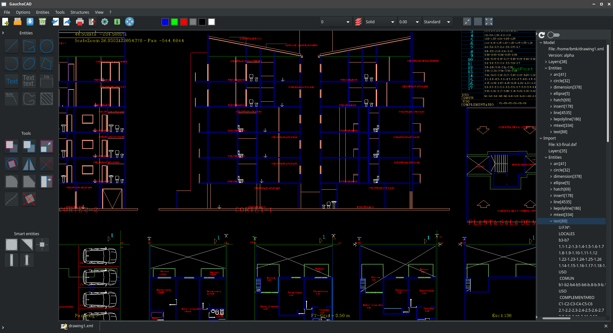

# GauchoCAD
GauchoCAD is a free CAD program written in the Gambas language.

# Road map
The graphics are supported by the opengl library.

# History
At the beginning this program was created as a practice in the use of classes and over time it was mutating, increasing the number of graphic tools, improving the interface etc.
CAD programs belong to the group of large and complex programs since for this to work it must handle various things from geometric calculations and graphical representation to configurations, user profiles, interpreter of orders, scripting printing, export and import of files, etc.
GauchoCAD is currently under development and the status is as follows:

## Links
# Gambas project
Gambas is a free development environment and a full powerful development platform based on a Basic interpreter with object extensions.
http://gambas.sourceforge.net/en/main.html

# Icons
LibreCAD

eraser
https://www.flaticon.com/packs/graphic-design-tools-6
