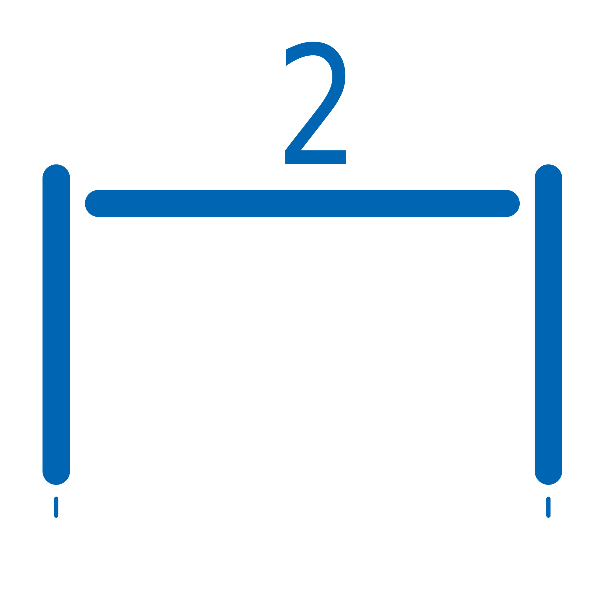
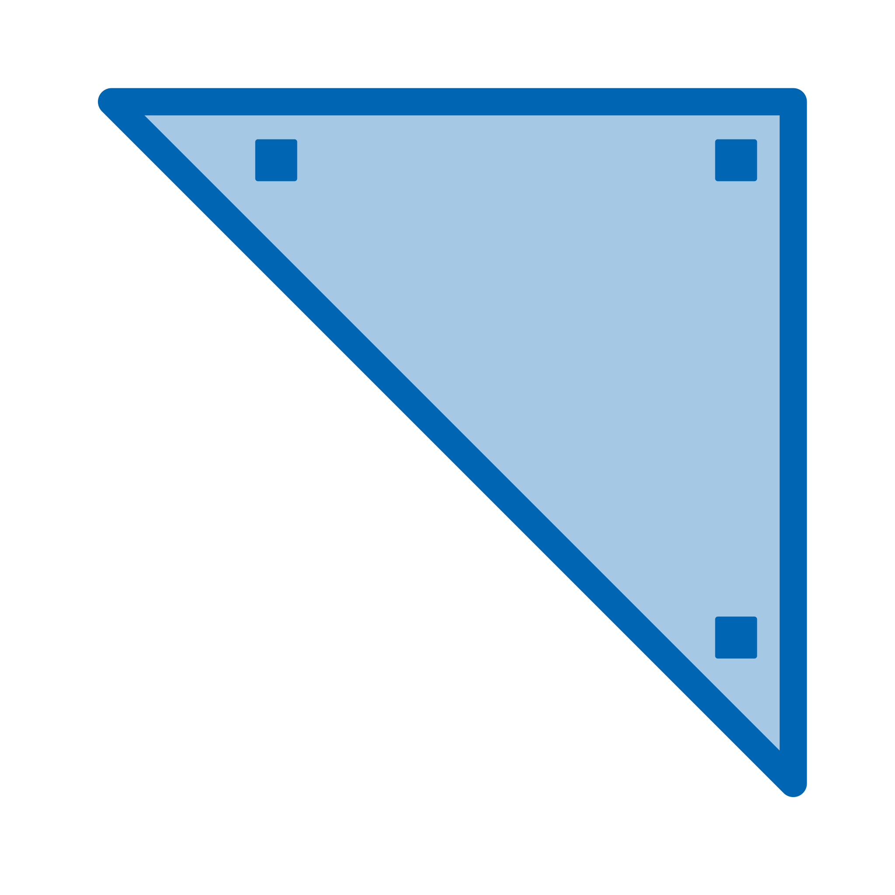

# GauchoCAD
GauchoCAD is a free CAD program written in the Gambas language.

## Graphics
Actually we use the OpenGL library for the graphics (before we try cairo and paint) because is really fast but some work still there with the diferent line styles like dashed

## History
At the beginning this program was created as a practice in the use of classes and over time it was mutating, increasing the number of graphic tools, improving the interface etc.
CAD programs belong to the group of large and complex programs since for this to work it must handle various things from geometric calculations and graphical representation to configurations, user profiles, interpreter of orders, scripting printing, export and import in differents files formats, etc.
GauchoCAD is currently under development and the status is as follows:

## Using

# Entities

 
 
 
 
 
 
 
 
 
 
 
 
 
 

# Tools 
 
 
 
 
 
 
 
 
 
 
 
 
 
 
 
 

# Layers
 

# Smart - concret structures
 
 
 
 
 
 

## Contact
gauchocad@gmail.com

## Gambas project
Gambas is a free development environment and a full powerful development platform based on a Basic interpreter with object extensions.
http://gambas.sourceforge.net/en/main.html

